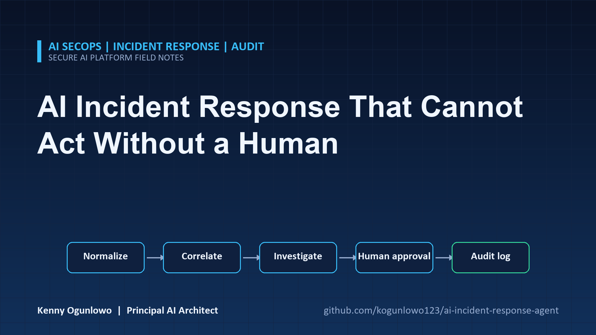
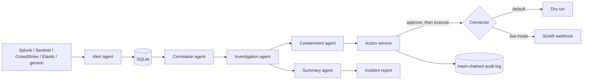
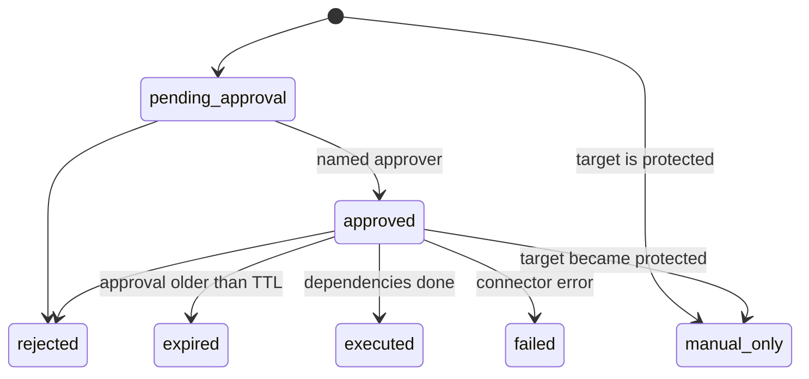

# AI Incident Response Agent



A multi-agent incident response pipeline for a security operations team. It reads alert exports from
several SIEM and EDR products, normalizes them into one schema, correlates related alerts into
incidents, investigates each incident, and proposes containment actions. Nothing is executed until a
named human approves it, and every step is written to a hash-chained audit log.

It is a decision-support tool. It does not replace an analyst, and it ships with a dry-run connector so
you can try the whole workflow without touching any real system.

## What it does

| Stage | Agent | Output |
| ----- | ----- | ------ |
| 1 | Alert agent | Normalizes Splunk, Microsoft Sentinel, CrowdStrike, Elastic and generic JSON Lines exports into one `Alert` model, with redacted command lines and canonical hosts, users, IPs, domains and hashes |
| 2 | Correlation agent | Groups alerts that share entities inside a time window, ignoring noisy accounts and over-connected hubs such as a scanner address |
| 3 | Investigation agent | Builds a timeline, matches indicators, adds asset and identity context, tests rule-based hypotheses, maps ATT&CK techniques and scores risk (P1 to P4) with the reasons listed |
| 4 | Containment agent | Proposes actions with guardrails: protected targets become manual-only, critical assets need a senior approver, isolation waits for a forensic snapshot |
| 5 | Summary agent | Writes an executive summary, by template or an optional model that only sees aggregate counts |
| 6 | Action service | Runs the approve, reject and execute state machine with approval expiry and an audit entry for every transition |





## Requirements

Python 3.10 or newer (tested on 3.10 to 3.13). Runtime dependencies are httpx, pydantic, pydantic-settings, PyYAML and tenacity. Every setting is optional and has a safe default: dry-run execution, no model provider, SQLite at `.socagent/socagent.db`. Ingestion is capped at `SOCAGENT_MAX_LINE_BYTES` per line and `SOCAGENT_MAX_LINES` per file.

## Quick start

```bash
python -m venv .venv && source .venv/bin/activate     # Windows: .venv\Scripts\activate
python -m pip install -e ".[dev]"

export SOCAGENT_DB_PATH=.socagent/soc.db
export SOCAGENT_ASSETS_FILE=configs/assets.example.yaml
export SOCAGENT_IOCS_FILE=configs/iocs.example.json
export SOCAGENT_POLICY_FILE=configs/policy.example.yaml

# Synthetic alerts in four vendor formats: an intrusion, a password attack and 40 noise alerts
socagent simulate --out feeds --start 2026-09-19T06:00:00Z
for s in splunk sentinel crowdstrike elastic; do socagent ingest --source $s feeds/$s.jsonl; done

socagent triage --now 2026-09-19T14:00:00Z
socagent incidents show INC-D3D90340
socagent actions list --incident INC-D3D90340
```

The simulator uses documentation address ranges (RFC 5737 and RFC 2544), so nothing in it points at a
real network.

### Example output

```text
Considered 48 alerts, 3 incidents, 17 new proposed actions (30 low-severity singletons suppressed).
INC-D3D90340  P1  risk 100  open          Malware execution with command and control: ws-042
INC-828A6A91  P4  risk  15  open          Unusual DNS query
INC-F2B44A84  P2  risk  60  open          Credential compromise: bob
```

The 48 alerts are 6 that belong to one intrusion across four products, 2 for a password attack on one
account, and 40 low-severity noise alerts. Thirty of the noise alerts touch the same scanner address, which
is over the hub threshold, so they are not linked and are suppressed as low-severity singletons. The other
ten share a quieter address and end up as one P4 incident. Raise or lower `max_entity_degree` in the
policy to change where that line falls.

The P1 report explains its score:

```text
## Why this score
- +60 highest alert severity is critical
- +20 spans 5 tactics (Initial Access, Execution, Lateral Movement, Command and Control, Exfiltration)
- +15 involves critical asset(s): srv-file01
- +15 matches 2 known-bad indicator(s)
- +5 6 correlated alerts
- +10 high-confidence hypothesis: malware execution
```

### Approval workflow

```bash
socagent actions list --incident INC-D3D90340

socagent actions execute ACT-20BCF7ADD5 --executor soc-analyst-1
# error: action is pending_approval; it must be approved before it can run

socagent actions approve ACT-6D4AFC8468 --approver soc-analyst-1     # snapshot ws-042
socagent actions approve ACT-20BCF7ADD5 --approver soc-analyst-1     # isolate ws-042
socagent actions execute ACT-20BCF7ADD5 --executor soc-analyst-1
# error: depends on actions that have not run: ACT-6D4AFC8468

socagent actions execute ACT-6D4AFC8468 --executor soc-analyst-1
socagent actions execute ACT-20BCF7ADD5 --executor soc-analyst-1
# ACT-20BCF7ADD5 executed: dry run: would isolate host ws-042

socagent actions approve ACT-173DD94555 --approver soc-analyst-1    # isolate srv-file01
# error: this action is high impact and needs a senior approver

socagent audit --verify
# audit log verified: chain intact
```

## Commands

| Command | Purpose |
| ------- | ------- |
| `ingest --source {splunk,sentinel,crowdstrike,elastic,generic} FILE` | Normalize and store a JSON Lines export |
| `simulate --out DIR [--start ISO] [--seed N]` | Write synthetic multi-vendor alerts |
| `triage [--lookback 24h] [--now ISO] [--fail-on P1\|P2\|P3]` | Correlate, investigate and propose actions. With `--fail-on`, exits 1 if a matching open incident exists, for use in a schedule or CI |
| `incidents list [--status S]` / `show ID [--format md,json] [--out DIR]` / `status ID STATUS --actor NAME` | Inspect incidents and change their status |
| `actions list [--incident ID] [--status S]` / `approve` / `reject` / `execute` | Review and act on proposals. IDs accept unique prefixes |
| `audit [--verify] [--limit N]` | Show the audit log or check that its hash chain is intact |

Exit codes: 0 success, 1 a gate failed (`--fail-on`, `audit --verify`), 2 the request was refused or invalid.

## Configuration

Environment variables use the `SOCAGENT_` prefix, and `.env.example` documents each one.

| File | Purpose |
| ---- | ------- |
| `configs/assets.example.yaml` | Asset inventory (criticality, owner) and identities (privileged, service account) |
| `configs/iocs.example.json` | Known-bad IPs, domains and hashes from your threat intelligence |
| `configs/policy.example.yaml` | Protected hosts, users and addresses, who may approve, who is senior, correlation window, approval lifetime |

Execution is a dry run by default. Live mode (`SOCAGENT_EXECUTION_MODE=live` plus
`SOCAGENT_CONNECTOR_URL`) posts each approved action to your SOAR or automation webhook, which performs
it. The URL is treated as a secret. This project does not talk to an EDR or identity provider directly.

## Design decisions

- Advisory containment. Proposals are cheap and reversible to reject. Execution needs a named approver from
  the policy, a senior approver for high-impact actions, a fresh approval, and finished dependencies.
- Protected targets (a domain controller, a break-glass account) can never be approved through this tool.
  The check runs again at execution time in case the policy changed after approval.
- Hypotheses are rules over alert content, not a model. Each one lists the alerts that support it, and the
  score lists its factors, so an analyst can disagree with a specific step.
- Attacker-influenced text never reaches a language model. The optional summary writer receives only
  counts and hypothesis names, and its output is discarded if it contains any number that is not in the
  facts.
- Secrets that appear in command lines, such as `-password value`, are redacted at ingestion, so they
  are not stored, reported or logged.
- The audit log chains each entry to the previous one with SHA-256, so editing or deleting a past entry
  is detectable with `audit --verify`.

More detail is in [docs/architecture.md](docs/architecture.md) and [docs/adr](docs/adr).

## Limitations

Read these before relying on the output.

- The vendor field mappings are written from public documentation and synthetic samples. Export formats
  vary with product version and configuration, so validate each normalizer against a real export before
  trusting it. Fields it cannot find are simply missing, not guessed.
- Hypotheses and scoring are heuristics. They will miss attacks that do not match a rule and can flag
  benign activity that looks like one.
- Approver names are strings checked against a policy list. There is no authentication, so run the CLI
  under an account and host you already control, and treat the audit log as a record of what was claimed.
- The hash chain detects edits by someone who does not recompute it. It does not stop an operator with
  full database access from rewriting the whole chain. Ship the log to write-once storage if that matters.
- There is no direct EDR, firewall or identity provider integration, only the generic webhook.
- It has been tested with synthetic data and mock servers, not against a live SIEM or SOAR.
- The MITRE ATT&CK catalogue is a subset of common techniques, not the full matrix.

## Development

```bash
make lint        # ruff check and format check
make typecheck   # mypy --strict
make cov         # tests with an 80% coverage gate (currently about 95%)
make audit       # pip-audit on runtime dependencies
```

The 180-plus tests run offline. They cover each vendor normalizer, correlation edge cases, every guardrail in
the approval workflow, audit tampering, the webhook connector against a mock transport, and full CLI runs.
See [CONTRIBUTING.md](CONTRIBUTING.md).

## Docker

```bash
docker build -t ai-incident-response-agent .
docker run --rm -v socagent-data:/data ai-incident-response-agent audit --verify
```

## License

MIT. See [LICENSE](LICENSE).
