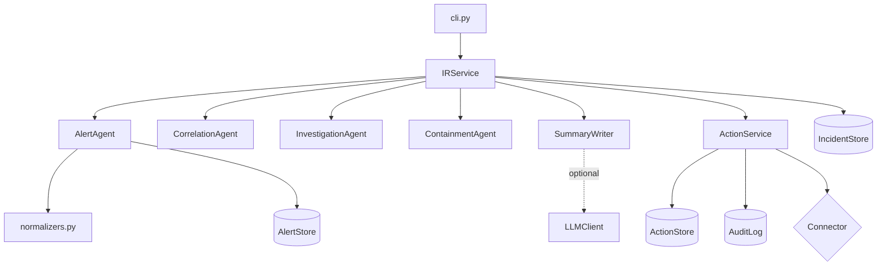

# Architecture

## Overview

`socagent` is a pipeline of small agents around one SQLite database. The composition root
(`container.build_service`) wires them, and `IRService` is the facade the CLI and library callers use.

## Modules

| Module | Responsibility |
| ------ | -------------- |
| `normalizers.py` | One function per vendor turning a raw record into an `Alert`. Field lookup is tolerant of flat and nested layouts. Command lines are redacted here |
| `security.py` | Secret redaction and canonical forms for IPs, hashes, domains, hosts, users and emails |
| `mitre.py` | A subset of ATT&CK tactics and techniques, with normalization and tactic lookup |
| `agents/ingest.py` | Streams a JSON Lines file with size and line limits, counts rejects without echoing content |
| `agents/correlation.py` | Union-find over shared entities within a window, skipping noise and hubs |
| `agents/investigation.py` | Timeline, indicator matching, context, hypotheses, scoring, incident assembly |
| `agents/containment.py` | Action proposals and their guardrails |
| `agents/summary.py` | Template and optional model-backed summaries, with a grounding check |
| `executor.py` | Connector protocol, dry-run and webhook connectors, the action state machine |
| `db.py` | SQLite with nestable transactions, stores and the audit log |
| `service.py` | Ingest, triage and status changes as one application service |
| `reporting.py` | Markdown and JSON incident reports |
| `simulate.py` | Deterministic multi-vendor scenario for demos and tests |

## Triage

1. Load alerts in the lookback window.
2. Correlate them. Two alerts link when they share an entity and are within the correlation window of each
   other. Entities that appear in more than `max_entity_degree` alerts are hubs, and configured noise users
   and addresses are ignored, so a scanner or `SYSTEM` cannot merge unrelated incidents.
3. Drop singleton groups below the configured severity.
4. Investigate each group and build an incident. The incident id is derived from its earliest alert, so it
   stays stable as later alerts join.
5. Propose actions, write the summary, and store both. Existing incidents keep their status and assignee, and
   existing actions keep their approval state, so triage can run on a schedule.
6. Close stored incidents whose alerts were absorbed into a larger incident.

## Correlation and scoring

Risk starts from the highest alert severity and adds points for tactic breadth, critical assets, privileged
or service accounts, indicator matches, alert volume, and high-confidence hypotheses. Every point is
recorded as a factor in the report. Priority maps from the score: P1 at 80 and above, P2 at 60, P3 at 35, P4
below that.

## Guardrails

| Rule | Where |
| ---- | ----- |
| Protected hosts, users and IPs become `manual_only` and cannot be approved | `containment._build`, `executor.approve` |
| The protected check repeats at execution | `executor.execute` |
| Critical assets, privileged accounts and service accounts need a senior approver | `containment._build`, `executor._check_approver` |
| Isolation depends on a snapshot of the same host | `containment.recommend`, `executor.execute` |
| Internal addresses are never proposed for blocking | `security.is_private_ip` |
| Approvals expire after `approval_ttl_minutes` | `executor.execute` |
| Low-risk notifications and tickets are pre-approved by `policy` and recorded as such | `containment._build` |

## Audit log

Each entry stores the hash of the previous entry and its own SHA-256 over the previous hash, timestamp,
actor, action, subject and detail. `verify()` recomputes the chain. Audit rows are written in the same
transaction as the state change they describe, and transactions nest, so a failure rolls back both.
An `action.execute.start` entry is written before the connector is called, so an execution that crashes
midway is still visible.

## Extending

- New vendor: add a function to `normalizers.py`, register it in `NORMALIZERS`, add a source literal to
  `Alert.source`, and test it with a real export.
- New hypothesis: add a rule in `investigation._hypotheses` that returns evidence alert ids.
- New action type: extend `ActionType`, add it to the ordering in `containment.recommend`, and decide its
  impact and reversibility in `_build`.
- Real integration: implement the `Connector` protocol and pass it to `build_service(connector=...)`.
